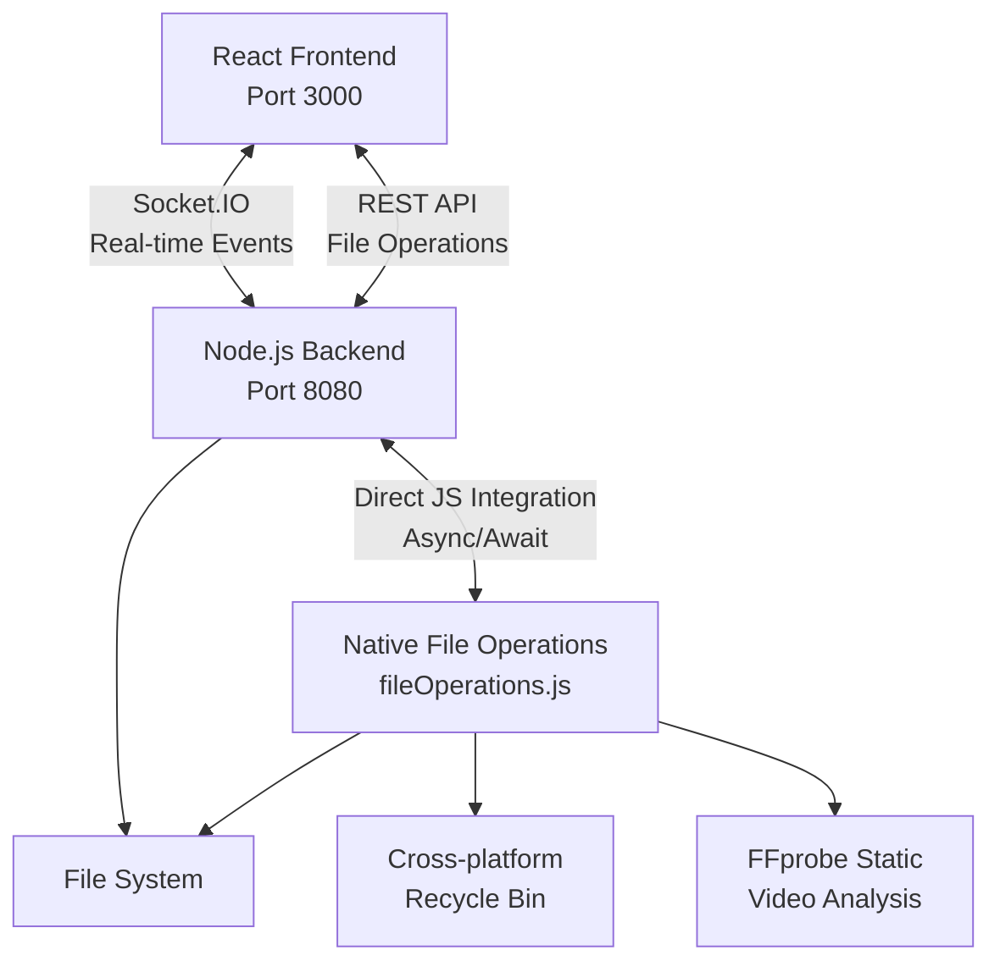

<div align="center">


# File Cleanup Automation Dashboard

*A modern web-based dashboard for automating file cleanup tasks with real-time progress tracking*

[](https://nodejs.org)
[](https://reactjs.org)
[](https://docs.microsoft.com/powershell)
[](LICENSE)

[Features](#features) • [Quick Start](#quick-start) • [Architecture](#architecture) • [Usage](#usage) • [API Reference](#api-reference)

</div>

## Overview

The File Cleanup Automation Dashboard is a powerful, real-time file management system that intelligently categorizes and organizes media files. Built with a modern 3-tier architecture, it combines React's responsive UI, Node.js backend services, and native JavaScript file operations to provide a seamless file cleanup experience.

The project offers both **web-based** and **desktop** applications:
- **Web Dashboard** - React SPA with real-time Socket.IO communication
- **Desktop App** - Tauri-based native desktop application (in development)

> [!TIP]
> This application supports dry-run mode for safe testing without modifying any files, and includes cross-platform recycle bin support for safe file deletion.

## Features

**🎯 Smart File Analysis**
- Native Node.js file operations with FFprobe integration
- Intelligent categorization of photos, short videos, and long videos
- Real-time file scanning with progress tracking
- Cross-platform compatibility (Windows, macOS, Linux)

**📱 Interactive File Management**
- In-browser image preview with full-screen viewing
- Native video playback controls
- Advanced sorting by name, size, or duration
- Individual file exclusion from cleanup operations
- Cross-platform recycle bin support for safe deletion

**⚡ Real-time Communication**
- Live progress updates via WebSocket connections
- Instant status notifications and error reporting
- Background process monitoring with abort capabilities

**🔧 System Integration**
- Cross-platform file opening with default applications
- Persistent user settings and preferences
- Configurable folder targets and ignore lists
- Operation logging with revert functionality

**🛡️ Safety & Validation**
- Comprehensive input validation and sanitization
- User confirmation before any file modifications
- Dry-run mode for safe testing
- Error boundaries and graceful error handling
- Automatic scan result saving and loading

## Quick Start

### Prerequisites

Before you begin, ensure you have the following installed:
- [Node.js](https://nodejs.org) (v18 or higher)
- [PowerShell](https://docs.microsoft.com/powershell) (v7+ recommended)
- [FFmpeg](https://ffmpeg.org/download.html) (for video analysis)

### Installation

1. **Clone the repository**
   ```bash
   git clone https://github.com/Stonelukas/automation-dashboard.git
   cd automation-dashboard
   ```

2. **Install dependencies**
   ```bash
   npm run install:all
   ```

3. **Start development environment**
   ```bash
   npm run dev
   ```

4. **Open your browser**
   - Navigate to `http://localhost:3000`
   - Backend API runs on `http://localhost:8080`

> [!NOTE]
> FFprobe is automatically installed as a Node.js dependency (`ffprobe-static`), so manual installation is not required.

## Architecture

This application follows a modern 3-tier architecture designed for real-time file processing:

### System Components



**Frontend Layer (React)**
- Interactive dashboard with responsive design
- Socket.IO client for real-time updates
- Advanced file preview and management
- Modern UI components with Tailwind CSS

**Backend Layer (Node.js + Express)**
- RESTful API endpoints for file operations
- Socket.IO server for real-time communication
- Direct integration with file operations service
- Cross-platform system integration

**File Operations Layer (Native Node.js)**
- Pure JavaScript file scanning and analysis
- FFprobe integration for video duration detection
- Cross-platform trash/recycle bin support via `trash` module
- Operation logging with revert functionality
- Real-time progress reporting via Socket.IO

## Usage

### How It Works

The cleanup process follows these intelligent steps:

1. **📁 Directory Scanning**
   - Scans specified directories with real-time progress
   - Identifies media files (photos, videos) and empty folders
   - Provides instant feedback on discovered files

2. **🎬 Video Analysis**
   - Uses FFprobe (via ffprobe-static) to determine video durations
   - Automatically categorizes based on configurable thresholds
   - Supports multiple video formats (MP4, AVI, MOV, etc.)
   - Cross-platform compatibility with native Node.js integration

3. **📋 File Categorization**
   - **Photos** (JPG, PNG, GIF, etc.) → Marked for deletion
   - **Short Videos** (< 9 seconds) → Marked for deletion  
   - **Long Videos** (≥ 9 seconds) → Marked for moving
   - **Empty Folders** → Marked for deletion

4. **🔍 Interactive Review**
   - Preview images with full-screen viewing
   - Play videos with native browser controls
   - Sort files by name, size, or duration
   - Exclude specific files from cleanup operations

5. **✅ User Confirmation**
   - Review detailed summary before execution
   - Confirm or cancel operations
   - Apply changes only to non-excluded files
   - Safe file deletion via cross-platform recycle bin support

### Development Workflow

**Development Mode** (Hot Reload)
```bash
npm run dev
```

**Production Build**
```bash
npm run start:prod
```

**Using PowerShell Scripts**
```powershell
# Development
.\start-dev.ps1

# Production  
.\start-prod.ps1
```

> [!NOTE]
> The PowerShell scripts are convenience wrappers around the npm commands and don't contain the core file operation logic.

### Configuration

**Application Settings** (via web interface):
- **Start Folder**: Root directory to scan
- **Video Move Target**: Destination for long videos  
- **Ignore Folders**: Comma-separated list of folders to skip
- **Dry Run Mode**: Enable safe testing without file modifications

**Environment Variables**:
```bash
# Backend (.env)
PORT=8080
NODE_ENV=development

# Frontend (.env)  
REACT_APP_SOCKET_URL=http://localhost:8080
```

## Project Structure

```
automation-dashboard/
├── 📁 backend/                 # Node.js Express server
│   ├── server.js              # Main server with Socket.IO and REST API
│   ├── fileOperations.js      # Native Node.js file operations service
│   ├── testFileOps.js         # Test script for file operations validation
│   ├── handlers/              # Socket.IO event handlers
│   ├── routes/                # API route definitions  
│   └── services/              # Business logic services
├── 📁 frontend/               # React SPA application
│   ├── src/
│   │   ├── components/        # Reusable UI components
│   │   │   ├── FileListModal.js    # Advanced file management modal
│   │   │   ├── StatusBadge.js      # Real-time status indicators
│   │   │   ├── ProgressBar.js      # Progress visualization
│   │   │   └── ErrorBoundary.js    # Error handling wrapper
│   │   ├── hooks/             # Custom React hooks
│   │   │   └── useUtilities.js     # Debouncing and localStorage
│   │   ├── utils/             # Utility functions
│   │   │   ├── validation.js       # Input validation and sanitization
│   │   │   └── businessLogic.js    # Application logic
│   │   └── App.js             # Main application component
│   └── build/                 # Production build output
├── 📁 Scripts/                # PowerShell convenience scripts
│   ├── cleanup.ps1           # Legacy PowerShell script (deprecated)
│   ├── start-dev.ps1         # Development environment starter
│   └── start-prod.ps1        # Production environment starter
├── 📁 tauri-app/             # Desktop application (separate implementation)
│   ├── src/                  # Tauri + React desktop app
│   └── src-tauri/            # Rust backend for desktop app
├── 📁 test_files/            # Sample files for testing
├── 📁 Doc/                   # Project documentation
└── package.json              # Workspace configuration
```

## API Reference

### REST Endpoints

**File Operations**
```http
GET /api/file?file={path}&t={timestamp}
```
Serves files with proper MIME types and cache-busting support.

```http
POST /api/open-file
Content-Type: application/json

{
  "filePath": "/path/to/file"
}
```
Opens files with system default applications (cross-platform).

### Socket.IO Events

**Client → Server Events**
- `startCleanup` - Begin cleanup process with configuration parameters
- `confirm` - Confirm cleanup execution after review
- `cancel` - Cancel current cleanup operation

**Server → Client Events**
- `status` - Real-time status updates and progress information
- `error` - Error messages and troubleshooting information

**Event Schema Example**
```javascript
// Status event payload
{
  stage: 'scanning|waiting|running|done|aborted',
  progress: {
    TotalVideos: 150,
    ProcessedVideos: 75,
    PhotosToDelete: 45,
    ShortVideosToDelete: 12,
    LongVideosToMove: 8,
    EmptyFoldersToDelete: 3
  },
  logs: ["Scanning folder: /path/to/folder", "Found 25 photos..."],
  isDryRun: false
}
```

## Troubleshooting

### Common Issues

**🔌 Connection Problems**
```bash
# Check if backend is running
curl http://localhost:8080/health

# Verify Socket.IO connection
# Look for "Connected to server" in browser console
```

**⚡ PowerShell Execution Issues**
> [!NOTE]
> The application no longer depends on PowerShell for core functionality. PowerShell scripts are only used as convenience wrappers for npm commands.

```bash
# If PowerShell scripts fail, use npm commands directly
npm run dev          # Instead of .\start-dev.ps1
npm run start:prod   # Instead of .\start-prod.ps1
```

**🎬 FFprobe Not Found**
> [!NOTE]
> FFprobe is automatically installed via the `ffprobe-static` npm package. Manual installation is not required.

```bash
# Verify FFprobe installation
npm list ffprobe-static

# If missing, reinstall backend dependencies
cd backend && npm install
```

**📁 Path Validation Errors**
- Use absolute paths only
- Avoid special characters in folder names
- Ensure target directories exist and are writable
- Check folder permissions

### Debug Mode

Enable detailed logging for troubleshooting:

```bash
# Backend debug logging
DEBUG=socket.io:* npm run dev

# Node.js file operations testing
cd backend && node testFileOps.js
```

> [!WARNING]
> Always test with dry-run mode enabled before making actual file changes.

## Performance & Security

**🚀 Performance Optimizations**
- Native Node.js operations eliminate PowerShell process spawning overhead
- FFprobe-static provides fast, reliable video duration detection
- Cross-platform trash module ensures safe file deletion across operating systems
- Debounced input validation prevents excessive API calls
- Persistent settings using localStorage for faster startup
- Efficient Socket.IO event batching prevents UI flooding
- Streaming file operations for large directories with progress tracking

**🛡️ Security Measures**
- Path validation prevents directory traversal attacks
- Input sanitization removes potentially dangerous characters
- CORS configuration restricts cross-origin requests in production
- Error boundaries prevent information leakage in error messages
- Native Node.js operations eliminate shell injection vulnerabilities

## Examples

**Basic Cleanup Operation**
```bash
# Start the application
npm run dev

# Configure in web interface:
# - Start Folder: C:\Users\Username\Downloads
# - Video Move Target: C:\Users\Username\Videos
# - Enable Dry Run for testing

# The system will:
# 1. Scan Downloads folder
# 2. Categorize files by type and duration  
# 3. Show preview with file counts
# 4. Allow individual file exclusions
# 5. Wait for user confirmation
# 6. Execute cleanup operations
```

**PowerShell Script Direct Usage** (Deprecated)
> [!WARNING]
> The PowerShell cleanup script (`cleanup.ps1`) is deprecated. The application now uses native Node.js file operations for better performance and cross-platform compatibility.

```powershell
# Legacy PowerShell script (not recommended)
.\Scripts\cleanup.ps1 -StartFolder "C:\Downloads" -VideoMoveTarget "C:\Videos" -DryRun

# Use the web interface instead for all file operations
npm run dev
```

## Resources

**Documentation & Guides**
- [Node.js Documentation](https://nodejs.org/docs) - Server runtime and APIs
- [React Documentation](https://react.dev) - Frontend framework and hooks
- [Socket.IO Documentation](https://socket.io/docs) - Real-time communication
- [FFprobe Documentation](https://ffmpeg.org/ffprobe.html) - Video analysis tool
- [Trash Module](https://github.com/sindresorhus/trash) - Cross-platform file deletion

**Desktop Application**
- [Tauri Documentation](https://tauri.app/v1/guides/) - Desktop app framework
- [Tauri Desktop App](./tauri-app/README.md) - Separate desktop implementation

**Related Projects**  
- [File Organizer](https://github.com/example/file-organizer) - Similar automation tools
- [Media Sorter](https://github.com/example/media-sorter) - Media file management
- [Node.js File Operations](https://nodejs.org/api/fs.html) - Native file system APIs

**Community & Support**
- [GitHub Issues](https://github.com/Stonelukas/automation-dashboard/issues) - Bug reports and feature requests
- [GitHub Discussions](https://github.com/Stonelukas/automation-dashboard/discussions) - Community support and ideas

> [!TIP]
> Star this project on GitHub if you find it useful! It helps others discover the project.

## Application Variants

This repository contains two implementations of the file cleanup automation system:

### 🌐 Web Dashboard (Primary)
**Location**: `frontend/` + `backend/`
- **Technology**: React + Node.js + Express + Socket.IO
- **Access**: Browser-based at `http://localhost:3000`
- **Features**: Full-featured web interface with real-time updates
- **Status**: ✅ Production ready, actively maintained

### 🖥️ Desktop Application (Alternative)
**Location**: `tauri-app/`
- **Technology**: Tauri + React + TypeScript + Rust
- **Access**: Native desktop application
- **Features**: Desktop-specific integrations and file system access
- **Status**: 🚧 In development, experimental

> [!TIP]
> For most users, the **Web Dashboard** is recommended as it's the primary, fully-featured implementation.

## Migration Status

### ✅ Completed Migrations
- **PowerShell → Node.js**: Core file operations migrated from PowerShell to native JavaScript
- **Process Spawning → Direct Integration**: Eliminated external process dependencies
- **FFmpeg → FFprobe Static**: Replaced system FFmpeg dependency with npm package
- **Manual Recycle Bin → Trash Module**: Added cross-platform safe deletion

### 🔄 Current Architecture
- **Backend**: Pure Node.js with async/await operations
- **File Operations**: Native JavaScript with cross-platform support
- **Video Analysis**: FFprobe via npm package (no system dependencies)
- **File Deletion**: Cross-platform recycle bin via `trash` module
- **Real-time Updates**: Direct Socket.IO integration
